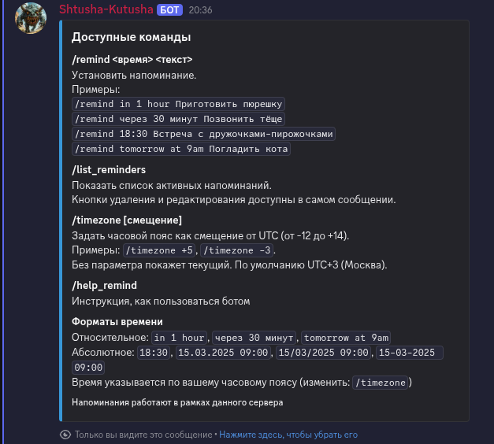
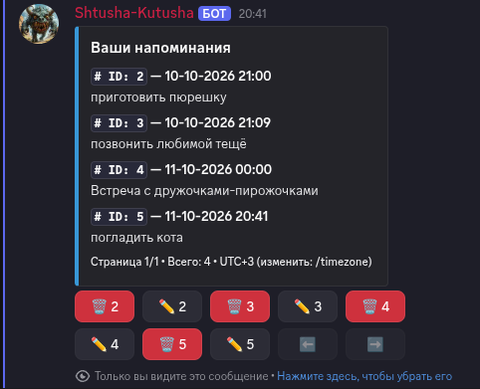

<p align="center">
  
</p>

<h1 align="center">Shtusha-Kutusha Bot</h1>

[](https://github.com/Wlwool/shtusha-kutusha/actions/workflows/tests.yml)
[](https://www.python.org/)
[](https://discordpy.readthedocs.io/)
[](https://www.docker.com/)
[](https://github.com/astral-sh/uv)
[](https://github.com/astral-sh/ruff)
[](https://mypy-lang.org/)

## Возможности

- Напоминания на точное время или через промежуток времени, на русском и английском.
- Список своих напоминаний с постраничным просмотром, удалением и редактированием кнопками.
- Личный часовой пояс для каждого пользователя.
- Восстановление напоминаний при перезапуске: будущие снова ставятся в расписание,
  пропущенные отправляются сразу.
- Динамический статус бота: число серверов, число участников, пинг.
- Журнал работы в консоль и в файл с ежедневной ротацией (хранятся 7 файлов).
- Запуск в Docker, данные в отдельном томе.

## Скриншоты

Слева список напоминаний с кнопками удаления и редактирования, справа справка по командам и форматам времени.

<p align="center">
  
  
</p>

## Команды

| Команда | Что делает |
|---|---|
| `/remind` | Устанавливает напоминание. Два поля: `time_str` (время) и `message` (текст) |
| `/list_reminders` | Показывает ваши активные напоминания с кнопками удаления и редактирования |
| `/timezone [offset]` | Задаёт часовой пояс как смещение от UTC, без параметра показывает текущий |
| `/help_remind` | Показывает справку |

Список напоминаний, ответы `/timezone` и сообщения об ошибках видны только вам. Подтверждение
`/remind` видят все в канале.

Примеры значений для `/remind`:

| `time_str` | `message` |
|---|---|
| `in 1 hour` | Приготовить обед |
| `через 30 минут` | Позвонить |
| `18:30` | Встреча |
| `15.03.2025 09:00` | Отправить отчёт |

Для `/timezone` в поле `offset` вводится смещение, например `+5` или `-3`.

### Форматы времени

- Относительное: `in 1 hour`, `через 30 минут`, `tomorrow at 9am`.
- Абсолютное: `18:30`, `15.03.2025 09:00`. Дату можно писать через `.`, `/` или `-`.
  Одна дата без времени означает полночь этого дня.
- Время всегда понимается по вашему часовому поясу.

## Часовые пояса и хранение времени

- По умолчанию используется UTC+3 (Москва). Пока вы не выбрали пояс, `/remind` напоминает
  про `/timezone`.
- Пояс задаётся целым числом часов от -12 до +14: `/timezone +5`, `/timezone -3`.
- Время в базе хранится в UTC. Смена пояса не двигает уже созданные напоминания, они
  сработают в тот же момент, меняется только то, как время показывается.
- Ограничения: нет поясов с минутами (например, +5:30) и нет автоматического перехода
  на летнее время.

## Как доставляются напоминания

- Напоминание, сработавшее вовремя, приходит в канал, где оно было создано.
- Если бот был недоступен и напоминание опоздало больше чем на минуту, оно приходит в личные
  сообщения с пометкой об опоздании. Если личные сообщения закрыты, оно приходит в канал.
- Если канал или пользователь удалены, доставить напоминание нельзя: текст пишется в журнал,
  запись удаляется.
- При других ошибках отправки запись остаётся в базе и будет отправлена при следующем запуске.

## 🐳 Запуск в Docker

Нужны Docker с Compose v2 и бот, созданный в [Discord Developer Portal](https://discord.com/developers/applications).

1. В Developer Portal на странице бота включить привилегированные интенты (Presence, Server
   Members, Message Content): бот запрашивает все интенты. Пригласите бота на сервер со
   скоупами `bot` и `applications.commands` и правом отправлять сообщения в нужных каналах.

2. Клонируйте репозиторий и создайте файл с настройками:

```bash
git clone https://github.com/Wlwool/shtusha-kutusha.git
cd shtusha-kutusha
cp .env.example .env
```

3. Впишите значения в `.env` (файл не попадает в Git):

| Переменная | Назначение |
|---|---|
| `DISCORD_TOKEN` | Токен бота, обязательна |
| `ADMIN_ID` | Идентификатор администратора|

4. Соберите образ и запустите:

```bash
docker compose up -d --build
```

База данных (`bot.db`) и журнал (`bot.log`) лежат в томе `bot_data`, который смонтирован в
контейнере в `/data`. Каталоги задаются переменными `DB_DIR` и `LOG_DIR`, в образе обе
равны `/data`. Без этих переменных (локальный запуск) файлы создаются в папке `bot/`.

### Управление

```bash
docker compose logs -f bot      # журнал в реальном времени
docker compose restart bot      # перезапуск
docker compose stop             # остановка
docker compose down             # остановка с удалением контейнера, том остаётся
```

Обновление:

```bash
git pull
docker compose up -d --build
```

> Важно: команда `docker compose down -v` удаляет том вместе с базой, то есть все напоминания и
> выбранные часовые пояса. Не используйте флаг `-v`, если не хотите начать с чистой базы.

## Локальная разработка

Нужны Python 3.13 и [uv](https://docs.astral.sh/uv/). Токен в `.env`, как описано выше.

```bash
uv sync                                   # зависимости, включая dev
uv run python -m bot.main    # запуск бота
```

Проверки (те же шаги выполняет CI на Python 3.13):

```bash
uv run ruff check
uv run ruff format --check
uv run mypy
uv run pytest
```

## 🛠️ Технологии

discord.py, aiosqlite (SQLite), APScheduler, dateparser, python-dotenv.
Инструменты: uv, pytest и pytest-asyncio, ruff, mypy, Docker

Discord-бот для напоминаний. Время можно задать точно (`18:30`, `15.03.2025 09:00`)
или словами (`через 30 минут`, `in 2 hours`, `tomorrow at 9am`). Напоминания хранятся
в SQLite и переживают перезапуск бота.

## Структура проекта

```text
bot/
  main.py            запуск бота, загрузка расширений, регистрация команд
  delivery.py        доставка напоминаний: канал, личные сообщения, ошибки
  database.py        работа с SQLite: напоминания, часовые пояса, миграция схемы
  tz.py              часовые пояса: разбор смещения, форматирование времени
  utils.py           разбор времени из текста
  help_cmd.py        команда /help_remind
  log_config.py      настройка журнала
  cogs/
    reminders.py     команды /remind, /list_reminders, /timezone
    status.py        динамический статус, восстановление напоминаний при старте
  ui/
    reminder_view.py список напоминаний, кнопки, окно редактирования
tests/               тесты (pytest)
Dockerfile           образ бота
docker-compose.yml   сервис и том с данными
pyproject.toml       зависимости и настройки ruff, mypy, pytest
.github/workflows/   CI: ruff, mypy, pytest
```
